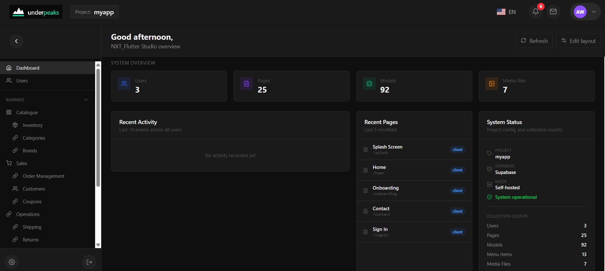

<!-- File: underpeaks-core/README.md -->

# Underpeaks Core

[](https://opensource.org/licenses/Apache-2.0)
[](https://www.npmjs.com/package/underpeaks-nxf)
[](https://github.com/underpeaks/underpeaks-core/pulls)
[](https://discord.gg/fNjwWrFPG)

**Build your backend once. Generate the rest.**

Underpeaks is a self-hosted, developer-first headless CMS that generates production-ready Flutter and Next.js applications from a single content model. Define your data once, and get a real backend, a content editor, a REST API, and — if you want it — a working mobile and web app, generated straight from it.



<!-- NOTE: this is currently a static dashboard screenshot. A short GIF/screen
     recording (model → nxf generate flutter → running app) would be an even
     stronger hook for GitHub browsers deciding in the first 10 seconds — worth
     swapping in post-launch if you get time to record one. -->

---

## Why Underpeaks

If you've ever built the same app for web and mobile, you know the tax: two codebases, two sets of backend glue code, one data model you're keeping in sync by hand. Change a field, update it in both places, miss one, ship a bug.

Underpeaks makes that one action — change the model, regenerate both. It also handles the backend work that quietly eats your week: auth that holds across devices, file storage without leaked keys, rate limits, consistent data.

No website builder, no drag-and-drop page editor. You already know how to build a frontend — Underpeaks builds the backend.

---

## Underpeaks Core vs Underpeaks Studio

| | **Underpeaks Core** | **Underpeaks Studio** |
|---|---|---|
| Hosting | Self-hosted, your infrastructure | Hosted, managed for you |
| Cost | Free, forever, open source | Paid, tiered plans |
| Database | 5 adapters: Supabase, PostgreSQL, MySQL, MongoDB, Firebase | Supabase (managed) |
| Code generation | Full Flutter + Next.js | Full Flutter + Next.js |
| Team members | Unlimited | Scales with plan |
| Integrations | — | AI, email, SMS/OTP, payments, and more |
| Support | Community (Discord) | Email → priority → Slack → dedicated, by plan |

Not sure which one you need? Start with Core — you can always move to Studio later once you know your usage.

---

## 1. Register an Account

Underpeaks Core needs a license key issued from Underpeaks Studio, even when you're running everything yourself.

1. Go to **[https://underpeaks.com](https://underpeaks.com)**
2. Sign up for a free account
3. Once logged in, generate a license key from your dashboard — you'll paste this into Core during setup

Keep this tab open; you'll need the key again shortly.

---

## 2. Get the Code

```bash
git clone https://github.com/underpeaks/underpeaks-core.git
cd underpeaks-core
npm install
```

---

## 3. Choose Your Database

Core supports five database backends — pick whichever you're most comfortable with:

- **Supabase**
- **PostgreSQL**
- **MySQL**
- **MongoDB**
- **Firebase**

You don't need to set up any environment variables by hand. The installer (next step) handles all of that for you — you'll just need your chosen database's connection details ready (host, credentials, project URL/keys, etc., depending on which one you pick).

---

## 4. Run the App

```bash
npm run dev
```

Visit **[http://localhost:3000](http://localhost:3000)** in your browser. Since this is a fresh install, you'll be automatically directed to the installer.

---

## 5. Run the Installer

The installer walks you through everything:

1. **Choose your database type** — pick from the 5 options above
2. **Enter your connection details** — the installer writes your `.env` configuration for you
3. **Database connection test** — confirms Core can reach your database
4. **Table creation** — creates all required system tables
5. **Demo content (optional)** — seeds a working example project so you have something to explore right away
6. **Admin account creation** — set the email and password for your first Core user
7. **License key** — paste the license key you generated in step 1

Once the installer finishes, you'll be redirected to sign in.

---

## 6. First Login

Sign in with the admin credentials you just created. You'll land in the **Console** — Core's admin dashboard.

---

## 7. Quick Tour

| Section | What it does |
|---|---|
| **Dashboard** | Overview stats and KPIs for your project |
| **Shared Models** | Define your data models — the schemas that power everything else |
| **Pages** | Build admin and client-facing pages using your models |
| **Menu** | Control what shows in your sidebar navigation |
| **Navigator** | Map out how pages connect and navigate to one another |
| **Theme** | Customize colors and branding |
| **Storage** | Upload and manage media files |
| **Users** | Manage who has access to your Core instance |
| **Settings** | Project name, license key, SMTP, API keys, and more |

---

## Generate a Flutter or Next.js App

Once you've defined a model and attached it to a page, install the CLI and generate:

```bash
npm install -g underpeaks-nxf
nxf login
nxf generate flutter   # or nextjs
```

See the [docs](https://docs.underpeaks.com) for the full code generation guide.

---

## Links

- 📖 [Documentation](https://docs.underpeaks.com)
- 💬 [Discord](https://discord.gg/fNjwWrFPG)
- 🏠 [Underpeaks Studio](https://studio.underpeaks.com)
- 🌐 [underpeaks.com](https://underpeaks.com)

---

## Contributing

Issues and pull requests are welcome. If you're planning a larger change, please open an issue first to discuss it — this project is actively maintained by a single developer, so a heads-up saves everyone time.

---

## Next Steps

- Create your first model under **Shared Models**
- Build a page for it under **Pages**
- Explore the generated admin views instantly — no extra config required

If you run into issues, check that your `.env.local` values match your database exactly, and that the database itself is reachable from wherever you're running Core.

---

**Questions or feedback?** Join the [Discord](https://discord.gg/fNjwWrFPG) or open an issue on GitHub. Underpeaks is built and maintained by one person, so please be patient with response times.

---

## License

Underpeaks Core is licensed under the [Apache License 2.0](./LICENSE).