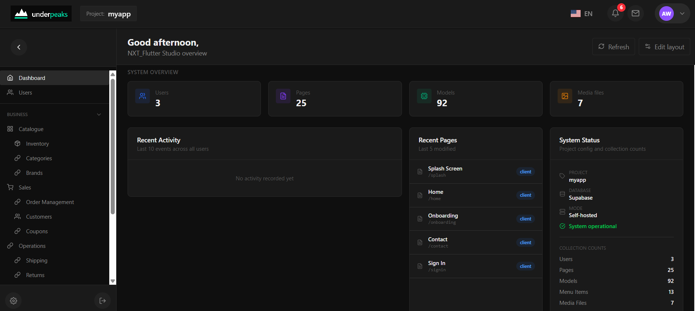

<!-- File: underpeaks-core/README.md -->

# Underpeaks Core

[](https://opensource.org/licenses/Apache-2.0)
[](https://www.npmjs.com/package/underpeaks-nxf)
[](https://github.com/underpeaks/underpeaks-core/pulls)
[](https://discord.gg/XRNXyNHBg)

**Build your backend once. Compile the rest.**

Underpeaks is a self-hosted, developer-first headless CMS that compiles production-ready Flutter and Next.js applications from a single content model. Define your data once, and get a real backend, a content editor, a REST API, and — if you want it — a working mobile and web app, generated straight from it.

**Compiled, not AI-generated:** the same model always produces the same code.

> **Before you start:** Core is free and open source, but it needs a **free license key** from an Underpeaks account. Creating one takes about 30 seconds — you'll be asked for the key the first time you sign in to Core.
> **[Create a free account →](https://underpeaks.com/signup?utm_source=github&utm_medium=readme)**

> **Hit a problem?** See [Troubleshooting](#troubleshooting) at the bottom of this page, join our [Discord](https://discord.gg/XRNXyNHBg), or [log an issue on GitHub](https://github.com/underpeaks/underpeaks-core/issues).



<!-- TODO: swap in a short GIF (model → nxf generate flutter → running app)
     once recorded, and add the YouTube install video link here. -->

---

## Why Underpeaks

If you've ever built the same app for web and mobile, you know the tax: two codebases, two sets of backend glue code, one data model you're keeping in sync by hand. Change a field, update it in both places, miss one, ship a bug.

Underpeaks makes that one action — change the model, regenerate both. It also handles the backend work that quietly eats your week: auth that holds across devices, file storage without leaked keys, rate limits, consistent data.

No website builder, no drag-and-drop page editor. You already know how to build a frontend — Underpeaks builds the backend.

---

## Underpeaks Core vs Underpeaks Studio

| | **Underpeaks Core** | **Underpeaks Studio** |
|---|---|---|
| Hosting | Self-hosted, your infrastructure | Hosted, managed for you |
| Cost | Free, forever, open source | Paid, tiered plans |
| Database | 5 adapters: Supabase, PostgreSQL, MySQL, MongoDB, Firebase | Supabase (managed) |
| Code generation | Full Flutter + Next.js | Full Flutter + Next.js |
| Team members | Unlimited | Scales with plan |
| Integrations | — | AI, email, SMS/OTP, payments, and more |
| Support | Community (Discord) | Discord + email → priority email → dedicated channel, by plan |

Not sure which one you need? Start with Core — you can always move to Studio later once you know your usage.

---

## Requirements

- **Node.js 20 or newer** (18.18 is the minimum)
- A database from the list in step 2

---

## 1. Get the Code

```bash
git clone https://github.com/underpeaks/underpeaks-core.git
cd underpeaks-core/main
npm install
```

---

## 2. Have Your Database Ready

Core supports five database backends — pick whichever you're most comfortable with:

- **Supabase**
- **PostgreSQL**
- **MySQL**
- **MongoDB**
- **Firebase**

You don't need to set up any environment variables by hand. The installer handles all of that for you — just have your chosen database's connection details ready (host, credentials, project URL/keys, etc., depending on which one you pick).

---

## 3. Run the App

```bash
npm run dev
```

Before the server starts, a quick check confirms your Node.js version and installed dependencies, and tells you how to fix anything that's missing.

Visit **[http://localhost:3000](http://localhost:3000)** in your browser. Since this is a fresh install, you'll be automatically directed to the installer.

> The first start compiles the app and can take a minute or two. Wait for the terminal to show **Ready** before opening the browser.

---

## 4. Run the Installer

The installer walks you through everything:

1. **Choose your database type** — pick from the 5 options above
2. **Enter your connection details** — the installer writes your `.env.local` configuration for you
3. **Database connection test** — confirms Core can reach your database
4. **Table creation** — creates all required system tables
5. **Demo content (optional)** — seeds a working example project so you have something to explore right away
6. **Admin account creation** — set the email and password for your first Core user

> **Important:** once the installer finishes, **stop the dev server (`Ctrl+C`) and start it again with `npm run dev`**, then sign in. Next.js only reads `.env.local` when the server starts, so skipping this restart can send you straight back to the sign-in page.

---

## 5. First Sign-in + License Key

Sign in with the admin credentials you just created. The first time you sign in, Core asks for your **license key**:

1. [Create a free Underpeaks account](https://underpeaks.com/signup?utm_source=github&utm_medium=readme) (about 30 seconds)
2. Copy the license key from your dashboard
3. Paste it into Core

You'll then land in the **Console** — Core's admin dashboard.

---

## 6. Quick Tour

| Section | What it does |
|---|---|
| **Dashboard** | Overview stats and KPIs for your project |
| **Shared Models** | Define your data models — the schemas that power everything else |
| **Pages** | Build admin and client-facing pages using your models |
| **Menu** | Control what shows in your sidebar navigation |
| **Navigator** | Map out how pages connect and navigate to one another |
| **Theme** | Customise colours and branding |
| **Storage** | Upload and manage media files |
| **Users** | Manage who has access to your Core instance |
| **Settings** | Project name, license key, SMTP, API keys, and more |

---

## Generate a Flutter or Next.js App

Once you've defined a model and attached it to a page, install the CLI and generate:

```bash
npm install -g underpeaks-nxf
nxf login
nxf generate flutter   # or nextjs
```

`nxf login` opens your browser to connect the CLI to your account. After that, `generate` produces a real project you own — models, API client and auth flows included.

See the [docs](https://underpeaks.com/docs/getting-started/introduction?utm_source=github&utm_medium=readme) for the full code generation guide.

---

## Troubleshooting

Check below first. You can also open **Help** (top bar, next to the language dropdown) inside the installer and sign-in pages for a searchable list of the same issues. If your problem isn't listed, see the [known issues on GitHub](https://github.com/underpeaks/underpeaks-core/issues?q=is%3Aissue+label%3Aknown-issue), join our [Discord](https://discord.gg/XRNXyNHBg), or [log an issue](https://github.com/underpeaks/underpeaks-core/issues).

### Errors before the server starts

**`Cannot find type definition file for 'express'` (or `'node'`)**
Dependencies are missing or incomplete. Delete the `node_modules` folder, run `npm install` again, then `npm run dev`. Make sure you are on the latest version of Core.

- Windows (PowerShell): `cmd /c rmdir /s /q node_modules`
- macOS / Linux: `rm -rf node_modules`

**`npm install` is very slow or seems stuck**
The first install can take several minutes, especially on slower disks or with other heavy apps open (video editors, screen recorders). Close them and let it finish.

**`The server cannot start yet` / Node.js version message**
Install the latest LTS version of Node.js from [nodejs.org](https://nodejs.org), then run `npm install` again.

**The first start or first sign-in is very slow**
The first run compiles the app. Wait for the terminal to show **Ready** before opening the browser. Later starts are much faster.

### Errors after the server starts

**Sign-in sends you straight back to the sign-in page after installing**
Symptom: you sign in and land back on the sign-in page, and the browser console shows `POST /api/session 401 (Unauthorized)`.
Fix: stop the dev server (`Ctrl+C`), run `npm run dev` again, then sign in. Next.js only reads `.env.local` when the server starts, so a server that was running during the install still has the old configuration. This only happens on localhost.

**The installer won't get past the database screen**
Symptom: the connection test or **Continue** doesn't move on, or sends you back to the same screen.
Fix: stop the dev server (`Ctrl+C`), run `npm run dev` again, open [http://localhost:3000](http://localhost:3000) and restart the installer from the beginning, re-entering your details. Don't edit `.env.local` by hand while installing. This has the same cause as above and only happens on localhost.

**Installer can't connect to the database:** double-check your connection details, and make sure the database is reachable from wherever you're running Core (cloud databases often need your IP allowed).

**Blank project is missing the Pages and Menu tables:** update to the latest version of Core and run the installer again on a fresh database.

**License key is rejected or can't be checked:** make sure you copied the full key from your Underpeaks dashboard and that the machine can reach the internet.

**Something looks off after setup:** check that your `.env.local` values match your database exactly.

**Stuck?** Ask in [Discord](https://discord.gg/XRNXyNHBg) or [open an issue](https://github.com/underpeaks/underpeaks-core/issues).

---

## Links

- 📖 [Documentation](https://underpeaks.com/docs/getting-started/introduction?utm_source=github&utm_medium=readme)
- 💬 [Discord](https://discord.gg/XRNXyNHBg)
- 🏠 [Underpeaks Studio](https://studio.underpeaks.com?utm_source=github&utm_medium=readme)
- 🌐 [underpeaks.com](https://underpeaks.com?utm_source=github&utm_medium=readme)

---

## Contributing

Issues and pull requests are welcome. If you're planning a larger change, please open an issue first to discuss it — this project is actively maintained by a single developer, so a heads-up saves everyone time.

**Questions or feedback?** Join the [Discord](https://discord.gg/XRNXyNHBg) or open an issue. Underpeaks is built and maintained by one person, so please be patient with response times.

---

## License

Underpeaks Core is licensed under the [Apache License 2.0](./LICENSE).